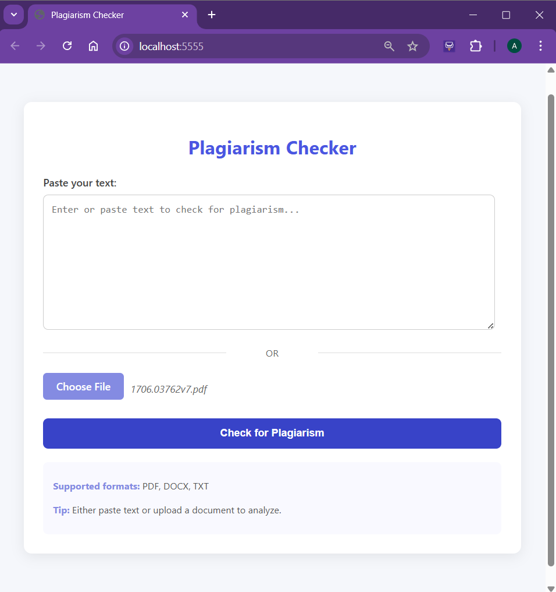
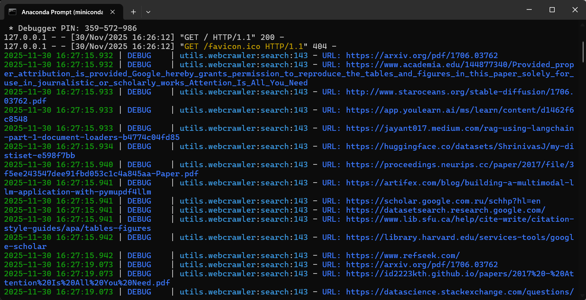
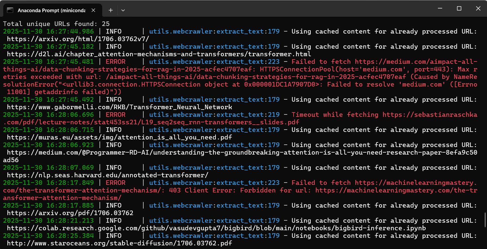
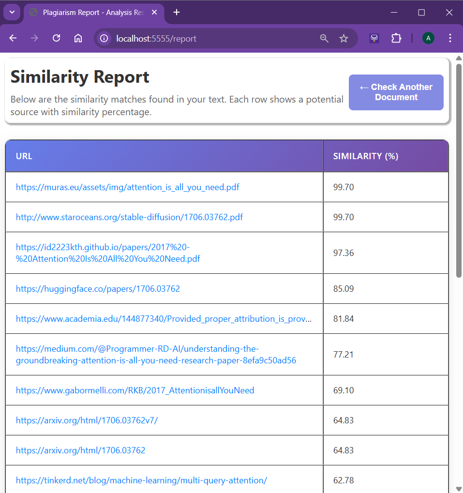

# PlagiarismChecker

A web-based plagiarism detection tool that analyzes user-submitted text or uploaded documents (PDF / DOCX / TXT), crawls the web, fetches matching content, and computes similarity scores — highlighting potential overlaps or plagiarism.

## Features

1. **Input Handling** — Accepts plain text input or file uploads (PDF, DOCX, TXT).  
2. **Content Extraction** — For PDF/DOCX: downloads and extracts text; for HTML pages: fetches and parses page text.  
3. **Crawling & Search** — Uses a search module to find potentially similar web pages by querying full text and individual sentences.  
4. **History & Caching** — Maintains a SQLite-based crawl history to avoid redundant downloads, and caches extracted text for reuse.  
5. **Text Normalization** — Lowercasing, stop-word removal, tokenization, while preserving sentence delimiters for better parsing.  
6. **Similarity Computation** — Supports two modes:  
   - **TF-IDF + Cosine Similarity** for quick baseline matches.  
   - **Transformer-based embeddings** (via `sentence-transformers`) for semantic similarity and paraphrase detection.  
7. **Report Generation** — Produces an HTML report/table with clickable source URLs and similarity scores.

## Project Structure

PlagiarismChecker/
├── main.py # Flask (or web) entrypoint and UI
├── utils/
│ ├── webcrawler.py # Crawling, URL blacklist, extraction (HTML/PDF/DOCX), caching
│ ├── similarity.py # Core logic: purification, crawling, similarity, report generation
| └── upload.py # Handles file upload and file type checking
├── requirements.txt
├── README.md # ← this file
└── … # other static files / templates

## Usage

1. Clone the repo:  git clone https://github.com/SheliJaju/PlagiarismChecker.git
2. Install dependencies:  pip install -r requirements.txt
3. Run the application (e.g. `python main.py`) and use the web form to paste text or upload document.  
4. View the generated similarity report — a table with source URLs and similarity percentage.

## Preview

Home page: (Example: "Attention is All You Need" paper uploaded)

Search function execution by WebCrawler:

Extract text function execution by WebCrawler:

Report Page:

## Limitations & Future Work

- For long documents / large crawls, time and bandwidth heavy.  
- Semantic similarity with embedding models may still miss deeply rephrased ideas.  

## Future enhancements 

- Exclude references/quoted text.  
- Allow bulk-document processing.  
- Add a GUI option to highlight overlapping passages.  
- Speed up by caching embeddings or using a vector database.  